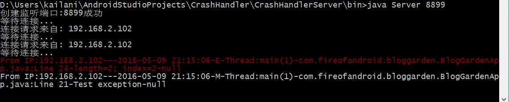

# CrashHandler

该开源库的主要功能是处理安卓程序中未捕获的异常并将消息发送到远程桌面端。服务端程序负责接收并显示客户端发送的消息；客户端是一个jar包，应用开发者将其导入到自己的项目中，在程序入口处进行相关初始化即可，在程序异常退出时会把崩溃信息发送到服务端。

## CrashHandlerServer文件夹 (服务端程序)

服务端程序是一个Java程序，使用Eclipse打开即可。

执行服务端程序时需要指定监听端口号，例如: `java Server 8899`.

服务端程序根据消息级别将收到的每条消息以特定颜色方案显示：

- 错误(E)——红色

- 消息(M) ——白色

## crashhandler文件夹 (客户端---jar包)

客户端jar包是使用Android Studio创建的，jar包输出目录位于crashhandler/release文件夹下，文件名是`CrashHandler.jar`。

## API

- `public static void init(Context context, String host, int port)`

说明：

> 在应用入口处调用该接口方法进行初始化，未捕获的异常将自动发送到服务端，并显示为“错误”级别(`E`)。

- `public static void reportException(Exception exception)`

说明：

> 在调用init()进行初始化后调用该接口向服务端汇报消息，类似日志功能，并显示为“消息”级别(`M`)。

## 示例

### 在PC端启动Server程序

### 客户端调用接口reportException汇报消息

`CrashHandler.reportException(new Exception("Test exception"));`

**说明:**

消息体封装为：

`日期`-`消息级别`-`线程名(线程号)`-`包名`+`文件名`+`行号`-`消息内容`。
